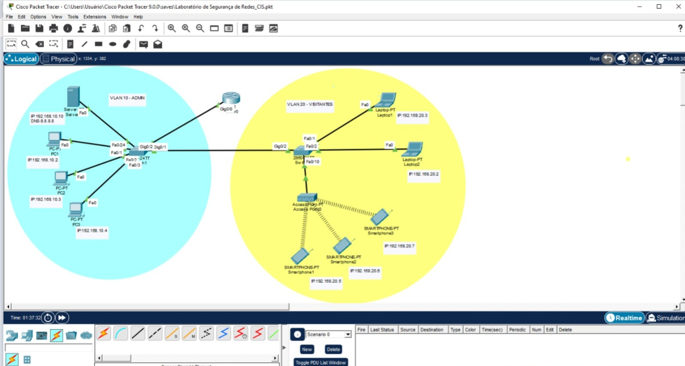
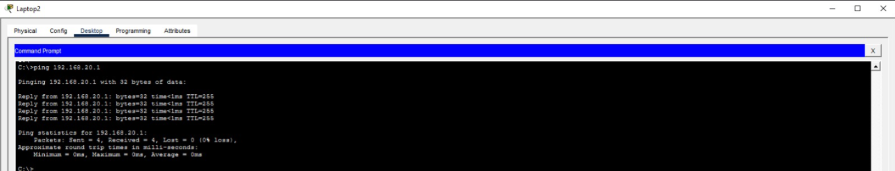
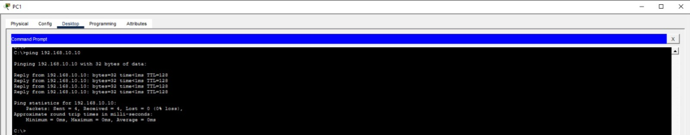
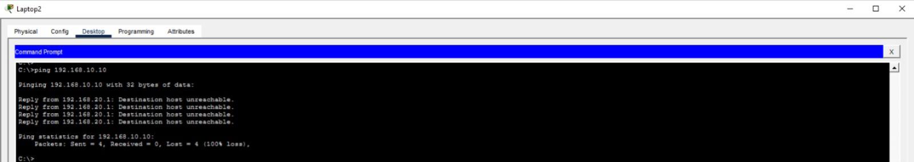

# Laboratório de Infraestrutura e Segurança de Redes Cisco

Este projeto demonstra a implementação de uma rede corporativa segmentada, focada em segurança e isolamento de tráfego, simulada no Cisco Packet Tracer.

##  Tecnologias e Conceitos Aplicados
* **VLANs (10 e 20):** Segmentação lógica para departamentos Administrativo e Visitantes.
* **Trunking (802.1Q):** Configuração de troncos entre switches e roteador.
* **Router on a Stick:** Roteamento Inter-VLAN via sub-interfaces.
* **DHCP Server:** Distribuição dinâmica de IPs para hosts e dispositivos wireless.
* **Segurança ACL:** Implementação de Access Control Lists para bloquear o acesso da rede de visitantes ao servidor interno.

##  Topologia

##  Testes de Validação
1. **Comunicação Interna:** Ping realizado com sucesso entre PCs e Servidor (VLAN 10).
2. **Isolamento de Segurança:** Tentativas de acesso dos Smartphones (VLAN 20) ao Servidor foram bloqueadas pelo Roteador (ACL 101), retornando `Destination host unreachable`.

##  Como abrir o projeto
1. Faça o download do arquivo `.pkt` neste repositório.
2. Abra utilizando o **Cisco Packet Tracer 8.0** ou superior.

## Conectividade do Gateway VLAN 20

##  Evidências de Testes
### Acesso Permitido VLAN 10  Servidor

### Acesso Bloqueado pela ACL VLAN 20 Servidor

